# SmileCare — Dental Clinic Online Appointment System

A full-stack **MERN** (MongoDB, Express.js, React.js, Node.js) web application for booking and managing dental appointments, designed and developed for the *Advanced Web Programming* final project.

SmileCare delivers a modern, secure, and responsive healthcare portal for both **patients** and **clinic staff**, built with a role-based architecture, dynamic slot scheduling, real-time analytics, and enterprise-grade web security practices.

---

## Table of Contents
- [System Architecture](#system-architecture)
- [Key Features](#key-features)
  - [Patient Experience](#1-patient-experience)
  - [Staff Administration & Analytics](#2-staff-administration--analytics)
  - [Security Hardening](#3-security-hardening)
- [System UI Preview](#system-ui-preview)
- [Tech Stack](#tech-stack)
- [REST API Reference](#rest-api-reference)
- [Demo Credentials](#demo-credentials)
- [Local Setup & Installation](#local-setup--installation)
- [Production Deployment Guide](#production-deployment-guide)
- [Project Directory Structure](#project-directory-structure)

---

## System Architecture

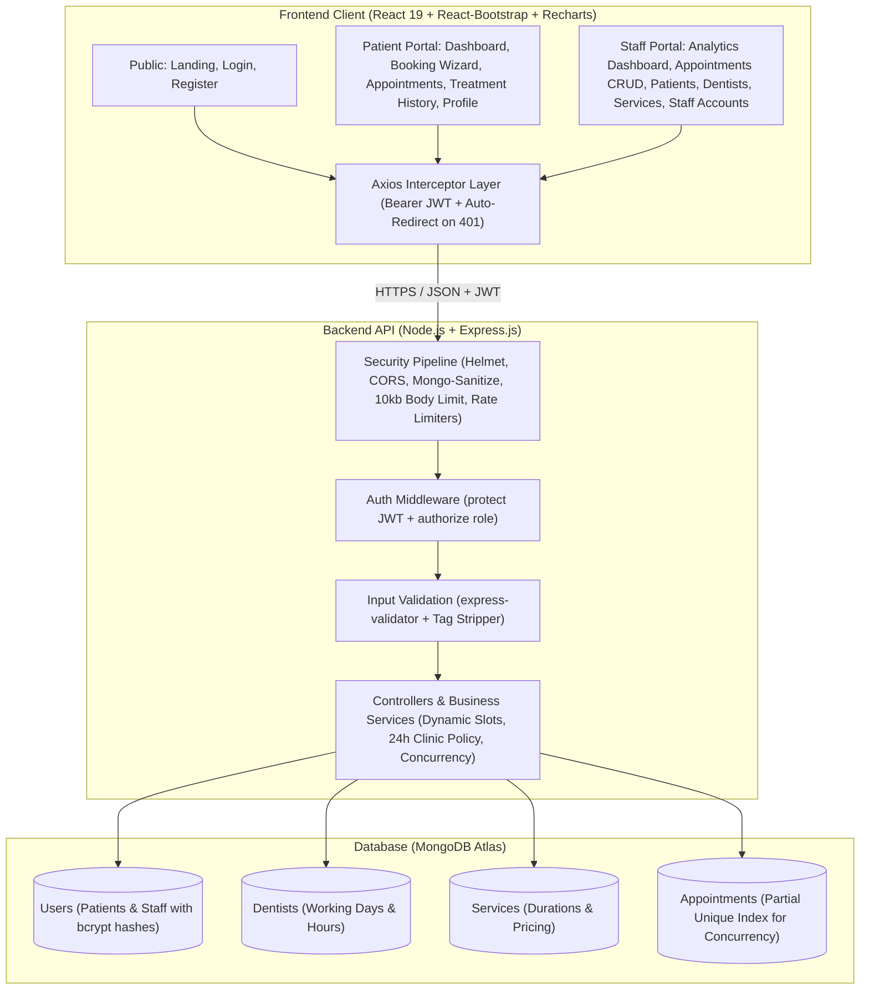

---

## Key Features

### 1. Patient Experience
- **Interactive 4-Step Booking Wizard**:
  1. *Service Selection*: Browse dental procedures with duration and pricing.
  2. *Dentist Selection*: Choose specialized dentists with schedules and bios.
  3. *Date & Time Slot Picker*: Real-time availability generation checking working days, clinic operating hours (Mon–Sat 9:00 AM – 5:00 PM Asia/Manila), existing bookings, and 30-minute slot increments.
  4. *Review & Confirm*: Pre-submission summary with optional visit notes and symptom descriptions.
- **Patient Dashboard**: Live summary of upcoming appointments, booking quick-actions, and visit status counters.
- **My Appointments Management**: Filter appointments by *Upcoming*, *Past*, and *All*, with status badges (*Pending*, *Confirmed*, *Completed*, *Cancelled*, *No-show*).
- **Online Reschedule & Cancellation**: Built-in enforcement of the **24-hour clinic rule** (patients can self-cancel or reschedule online up to 24 hours prior to appointment start time; within 24 hours, the portal directs the patient to contact the clinic).
- **Treatment & Clinical History**: Complete timeline of past procedures, diagnostic findings, prescriptions, and recommended follow-up dates recorded by attending clinicians.
- **Profile Management**: Update contact information, address, and medical notes; secure password change with verification.

### 2. Staff Administration & Analytics
- **Live Analytics Dashboard**:
  - Operational metrics: Appointments today, pending confirmations, total registered patients, active dentists, and available services.
  - **14-day appointment trend chart** rendered via Recharts.
  - **Status distribution donut chart** with interactive legends.
  - Today's clinic schedule feed with quick status transition actions.
  - Top requested dental services breakdown.
- **Full Appointments CRUD**:
  - Filter by search keyword (patient name, dentist, service), appointment status, assigned dentist, and date ranges.
  - Staff appointment creator with debounced patient selector.
  - Status lifecycle management (*Confirm*, *Complete*, *Mark No-show*, *Cancel* with audit reasons, and *Delete*).
  - Clinical Treatment Notes modal to record diagnosis, procedure, doctor's notes, prescriptions, and follow-up schedules.
- **Patients Directory**: Comprehensive directory with search, active/inactive filters, patient medical notes, visit history, and record editing.
- **Dentists Directory**: Manage clinic doctors, specializations, contact details, working days (Mon–Sat), and shift timings.
- **Services Catalog**: Manage dental procedures, standardized duration slots (30 to 180 minutes), and pricing.
- **Staff Accounts Administration**: Create and manage administrative team accounts with self-protection guards preventing accidental self-deactivation or deletion.

### 3. Security Hardening
*(Refer to [`docs/SECURITY.md`](./docs/SECURITY.md) for the complete audit and code location mapping)*
- **Authentication**: Salted bcrypt password hashing (12 rounds); stateless JSON Web Tokens (JWT) signed with 64-byte random secrets and 24-hour expiry.
- **Role-Based Access Control (RBAC)**: Route-level authorization guards for both client-side navigation and server REST endpoints. Public registration is locked to the `patient` role.
- **IDOR Prevention**: Server queries enforce patient ownership checks (`patient: req.user._id`), preventing unauthorized cross-user data access.
- **NoSQL Injection Defense**: `express-mongo-sanitize` strips `$` and `.` operators from request bodies, parameters, and query strings.
- **XSS Sanitization**: Custom HTML tag stripping on free-text inputs combined with React's contextual auto-escaping on render.
- **HTTP Hardening**: Helmet security headers (CSP, HSTS, frameguard, nosniff), strict CORS origin whitelisting, and a strict 10kb body payload ceiling.
- **Brute-Force Rate Limiting**: Dedicated auth rate limiter (10 attempts / 15 min / IP) on login and registration, and global API rate limiter (300 requests / 15 min / IP).
- **Concurrency & Double-Booking Protection**: Unique partial index on `{ dentist: 1, date: 1, startTime: 1 }` where `slotActive: true` guarantees zero overlapping appointments at the database level.

---

## System UI Preview

| Landing Page | Patient Dashboard |
|:---:|:---:|
| 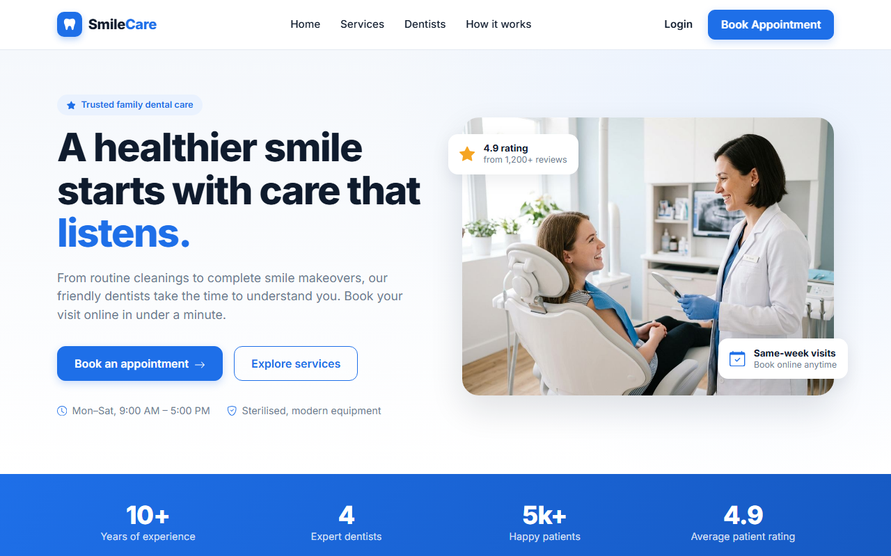 | 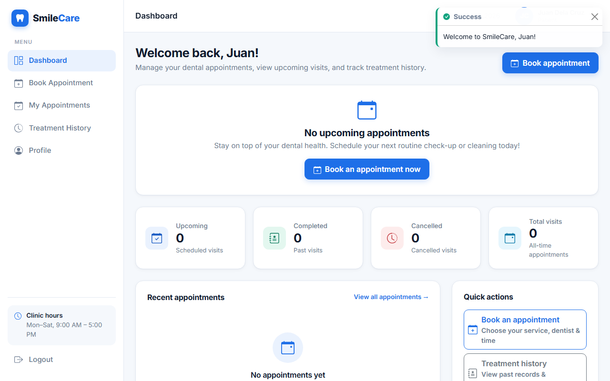 |

| 4-Step Booking Wizard (Slots) | 4-Step Booking Wizard (Confirm) |
|:---:|:---:|
| 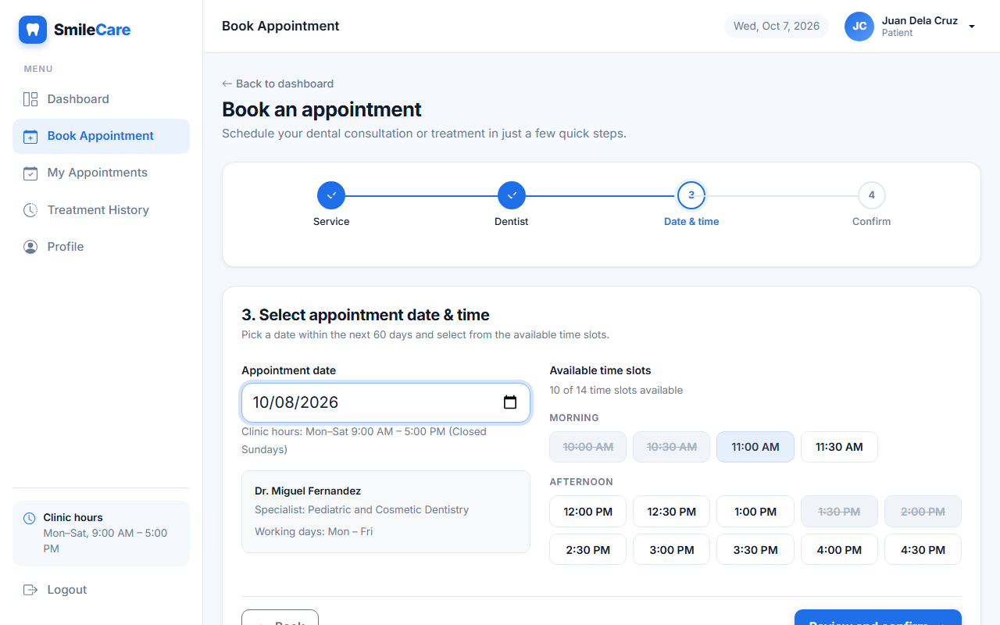 | 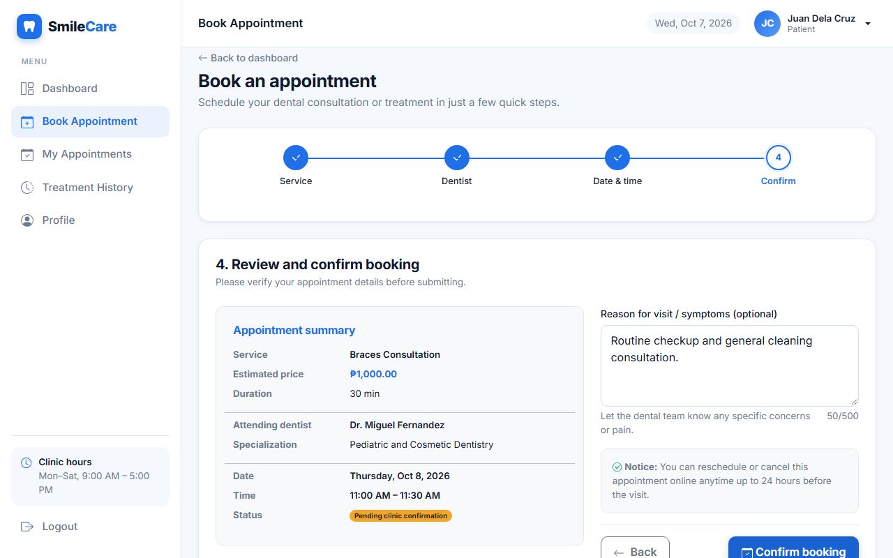 |

| Appointment Detail (24h Policy) | Patient Appointments List |
|:---:|:---:|
| 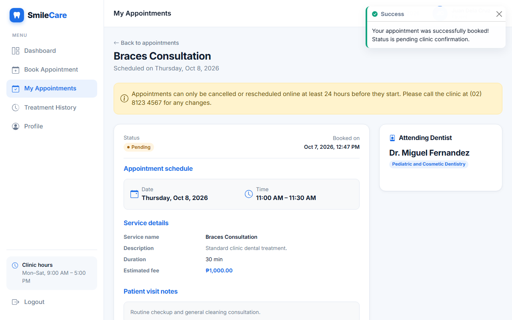 | 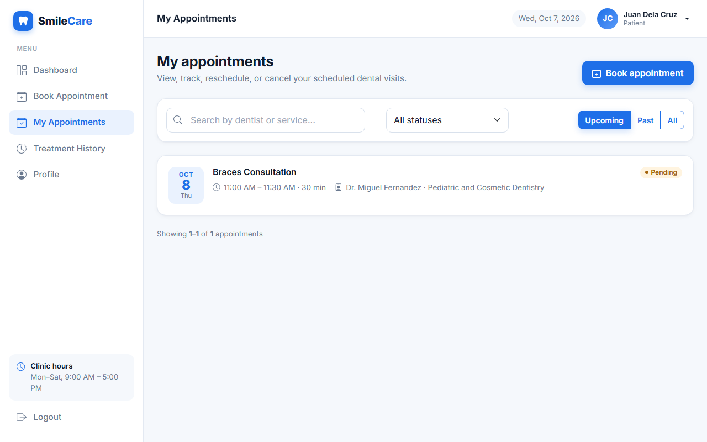 |

| Staff Analytics Dashboard | Staff Appointments Management |
|:---:|:---:|
| 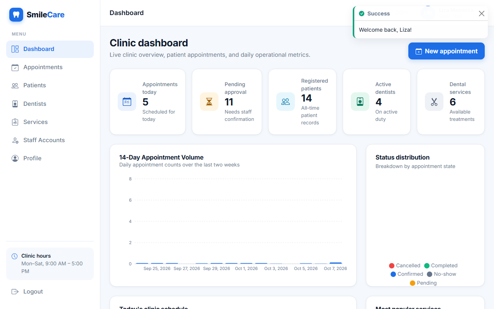 | 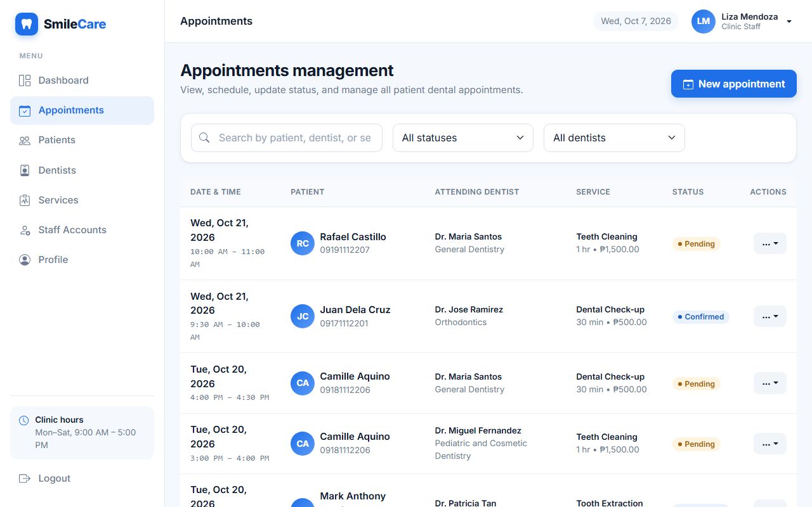 |

| Staff Patients Directory | Mobile Responsive View (375px) |
|:---:|:---:|
| 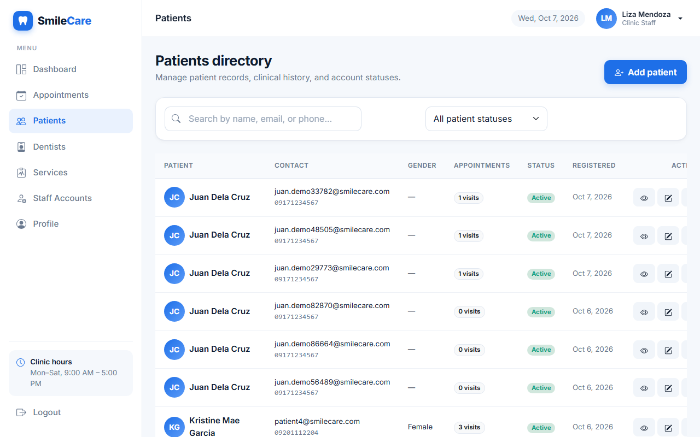 | 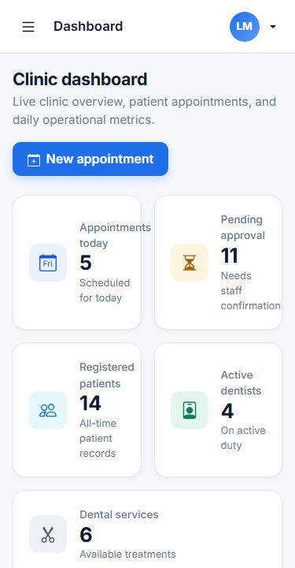 |

---

## Tech Stack

| Layer | Technology | Details |
|---|---|---|
| **Frontend UI** | React 19, React-Bootstrap 5.3, Bootstrap Icons | Responsive UI with custom theme overrides (`theme.css`) |
| **Routing** | React Router v7 | Declarative routing, `ProtectedRoute`, `RoleRoute`, `GuestRoute` |
| **Charts** | Recharts v3 | Responsive trend bar charts and appointment status donut charts |
| **HTTP Client** | Axios | Interceptors for Bearer JWT injection and 401 session expiration |
| **Build Tool** | Vite 8 | Fast ESM bundler with production asset optimization |
| **Backend API** | Node.js 22, Express.js 4 | RESTful architecture with modular routers and controllers |
| **Database** | MongoDB Atlas, Mongoose 8 | Schema modeling, compound partial indexes, aggregation pipelines |
| **Auth & Security** | JWT, bcryptjs, Helmet, Express-Rate-Limit | Strict password policy, CORS whitelisting, mongo-sanitize |
| **Testing & QA** | Playwright, Custom Smoke Runner | Full API smoke test suite (116 assertions) and E2E browser QA |

---

## REST API Reference

All responses adhere to the standard JSON envelopes:
- **Success**: `{ success: true, data: ..., message?: string, pagination?: { page, limit, total, totalPages } }`
- **Error**: `{ success: false, message: string, errors?: [{ field, message }] }`

| Method | Endpoint | Access | Description |
|---|---|---|---|
| `POST` | `/api/auth/register` | Public | Register a new patient account (rate-limited) |
| `POST` | `/api/auth/login` | Public | Login with email and password, returns JWT token (rate-limited) |
| `GET` | `/api/auth/me` | Protected | Retrieve authenticated user profile |
| `PUT` | `/api/users/me` | Protected | Update profile information |
| `PUT` | `/api/users/me/password` | Protected | Change password (requires current password) |
| `GET` | `/api/services` | Public / Patient / Staff | List active dental services and pricing |
| `POST` | `/api/services` | Staff | Create a new dental service |
| `PUT` | `/api/services/:id` | Staff | Update service name, duration, price, or status |
| `DELETE` | `/api/services/:id` | Staff | Delete service (blocked if active appointments exist) |
| `GET` | `/api/dentists` | Public / Patient / Staff | List dentists with working days and hours |
| `GET` | `/api/dentists/:id/availability` | Protected | Calculate available 30-minute time slots for date and service |
| `POST` | `/api/dentists` | Staff | Add a new dentist record |
| `PUT` | `/api/dentists/:id` | Staff | Update dentist specialization, working days, or hours |
| `DELETE` | `/api/dentists/:id` | Staff | Delete dentist (blocked if active appointments exist) |
| `GET` | `/api/appointments` | Protected | List appointments (Patients: own only; Staff: all with filters) |
| `GET` | `/api/appointments/:id` | Protected | Get appointment details (ownership enforced for patients) |
| `POST` | `/api/appointments` | Protected | Book appointment (Patients: self; Staff: any patient) |
| `PUT` | `/api/appointments/:id` | Protected | Reschedule/edit appointment (enforces 24h rule for patients) |
| `PATCH`| `/api/appointments/:id/status`| Protected | Update status (Patients: cancel >= 24h; Staff: confirm/complete/etc.) |
| `PUT` | `/api/appointments/:id/treatment`| Staff | Record or update clinical diagnosis, procedure, and notes |
| `DELETE`| `/api/appointments/:id` | Staff | Remove appointment record |
| `GET` | `/api/patients` | Staff | Search and list registered patients with pagination |
| `GET` | `/api/patients/:id` | Staff | Get patient medical profile and appointment history |
| `POST` | `/api/patients` | Staff | Register a new patient record from the clinic desk |
| `PUT` | `/api/patients/:id` | Staff | Update patient details, active status, or reset password |
| `DELETE`| `/api/patients/:id` | Staff | Delete patient and cascade associated appointments |
| `GET` | `/api/staff` | Staff | List staff members |
| `POST` | `/api/staff` | Staff | Create a new staff account |
| `PUT` | `/api/staff/:id` | Staff | Update staff information or password |
| `DELETE`| `/api/staff/:id` | Staff | Delete staff member (self-deletion blocked) |
| `GET` | `/api/dashboard/patient` | Patient | Patient stats (upcoming, completed, cancelled, total visits) |
| `GET` | `/api/dashboard/staff` | Staff | Staff metrics, 14-day trend, status distribution, today's visits |
| `GET` | `/api/health` | Public | System liveness probe (`{ status: "ok" }`) |

---

## Demo Credentials

The database comes pre-seeded with realistic Philippine clinic data (4 dentists, 6 services, 8 patients, and 68 past/current/future appointments):

| Role | Email | Password | Access Scope |
|---|---|---|---|
| **Clinic Staff (Admin)** | `admin@smilecare.com` | `Sc!f00Re1JvqIsF9a` | Full administration, analytics, staff accounts |
| **Clinic Staff** | `staff@smilecare.com` | `Staff@12345` | Appointments CRUD, patients directory, clinical notes |
| **Patient (Demo 1)** | `patient1@smilecare.com` | `Patient@123` | Patient portal, booking wizard, appointments, history |
| **Patient (Demo 2)** | `patient2@smilecare.com` | `Patient@123` | Patient portal, booking wizard, appointments, history |

*You may also use the public **Register** page to create a new patient account instantly.*

---

## Local Setup & Installation

### Prerequisites
- **Node.js**: v18.0.0 or higher (v20+ recommended)
- **MongoDB**: MongoDB Atlas connection string (or local MongoDB v6+)
- **Git**

### 1. Clone the Repository
```bash
git clone https://github.com/gbrlvrn/SmileCare.git
cd SmileCare
```

### 2. Backend Setup
```bash
cd server
npm install

# Create environment configuration
cp .env.example .env
```

Edit `server/.env` with your settings:
```env
PORT=5000
NODE_ENV=development
MONGODB_URI=your_mongodb_atlas_connection_string
JWT_SECRET=your_super_secret_64_character_key_here
JWT_EXPIRES_IN=1d
CLIENT_URL=http://localhost:5173
CLINIC_TIMEZONE=Asia/Manila
SEED_ADMIN_EMAIL=admin@smilecare.com
SEED_ADMIN_PASSWORD=Sc!f00Re1JvqIsF9a
```

Populate the database with sample clinic data:
```bash
npm run seed
```

Start the API server:
```bash
# Production start
npm start

# Development with automatic reload
npm run dev
```
*The API will listen at `http://localhost:5000` (Health check: `http://localhost:5000/api/health`).*

### 3. Frontend Setup
In a new terminal window:
```bash
cd ../client
npm install

# Create environment configuration
cp .env.example .env
```

Ensure `client/.env` points to your backend:
```env
VITE_API_URL=http://localhost:5000/api
```

Start the Vite development server:
```bash
npm run dev
```
*Open your browser and navigate to `http://localhost:5173`.*

---

## Production Deployment Guide

SmileCare is structured for fast, independent deployment of the backend and frontend:

### Backend Deployment (Render / Railway)
1. Create a new **Web Service** pointing to the repository root with root directory set to `server`.
2. **Build Command**: `npm install`
3. **Start Command**: `npm start`
4. Add the following **Environment Variables**:
   - `NODE_ENV`: `production`
   - `PORT`: `5000` (or host-assigned)
   - `MONGODB_URI`: `<Atlas URI>`
   - `JWT_SECRET`: `<Secure random 64-char string>`
   - `JWT_EXPIRES_IN`: `1d`
   - `CLIENT_URL`: `https://smilecare.vercel.app` (your frontend domain)
   - `CLINIC_TIMEZONE`: `Asia/Manila`

### Frontend Deployment (Vercel)
1. Import the repository on **Vercel** with the Root Directory set to `client`.
2. **Framework Preset**: `Vite`
3. **Build Command**: `npm run build`
4. **Output Directory**: `dist`
5. Configure the **Environment Variable**:
   - `VITE_API_URL`: `https://smilecare-api.onrender.com/api` (your backend URL)
6. Single-Page Application (SPA) routing is pre-configured via `client/vercel.json`:
```json
{
  "rewrites": [
    { "source": "/(.*)", "destination": "/index.html" }
  ]
}
```

---

## Project Directory Structure

```
SmileCare/
├── client/                          # React 19 Frontend (Vite)
│   ├── public/                      # Static assets & favicon
│   ├── src/
│   │   ├── api/                     # Axios client & modular API endpoints
│   │   ├── assets/                  # Hero and auth branding photography
│   │   ├── components/              # Shared UI components (Modals, Badges, Slots, Stepper)
│   │   │   ├── patient/             # Patient-specific cards & CSS
│   │   │   └── staff/               # Staff Recharts components & forms
│   │   ├── context/                 # AuthContext & ToastContext
│   │   ├── hooks/                   # Custom hooks (useAuth, useFetch, useListQuery, useForm)
│   │   ├── layouts/                 # PublicLayout, AuthLayout, DashboardLayout (with responsive Offcanvas)
│   │   ├── pages/
│   │   │   ├── public/              # Landing, Login, Register, NotFound
│   │   │   ├── patient/             # Dashboard, Booking Wizard, Appointments, Detail, History
│   │   │   ├── staff/               # Dashboard, Appointments, Patients, Dentists, Services, Accounts
│   │   │   └── shared/              # Profile & Password Management
│   │   ├── routes/                  # ProtectedRoute, RoleRoute, GuestRoute
│   │   ├── styles/                  # Clean CSS variables & theme overrides (theme.css)
│   │   └── utils/                   # Validators, currency/date formatters, clinic constants
│   ├── package.json
│   ├── vercel.json                  # SPA routing configuration
│   └── vite.config.js
│
├── server/                          # Express.js REST API (Node.js 22)
│   ├── scripts/
│   │   └── seed.js                  # Atlas database seeder (Philippine clinic dataset)
│   ├── src/
│   │   ├── config/                  # Mongoose MongoDB connection handler
│   │   ├── controllers/             # Business logic & CRUD handlers
│   │   ├── middleware/              # Auth protect/authorize, rateLimiters, errorHandler, validate
│   │   ├── models/                  # Mongoose models: User, Dentist, Service, Appointment
│   │   ├── routes/                  # Express REST routes mounted under /api
│   │   ├── services/                # Booking engine, slot generator, overlap checker
│   │   ├── utils/                   # Timezone calculations, pagination, regex escaping, token generator
│   │   ├── validators/              # express-validator rules per entity & tag stripper
│   │   ├── app.js                   # Express application setup & middleware stack
│   │   └── server.js                # Server entry point & graceful shutdown
│   ├── package.json
│   └── .env.example
│
├── design/
│   └── screenshots/                 # 16 High-resolution UI walkthrough screenshots
├── docs/
│   ├── API.md                       # Comprehensive REST API Contract
│   └── SECURITY.md                  # Rubric Security Measures & Code Audit
└── README.md
```
